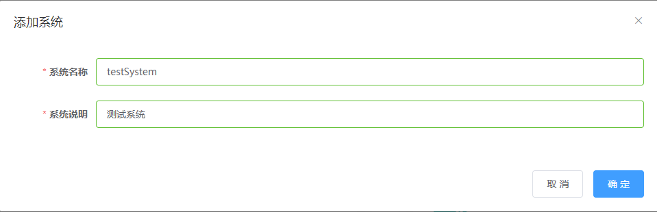
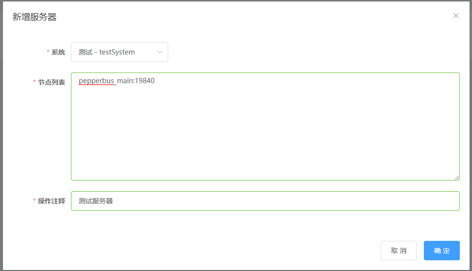
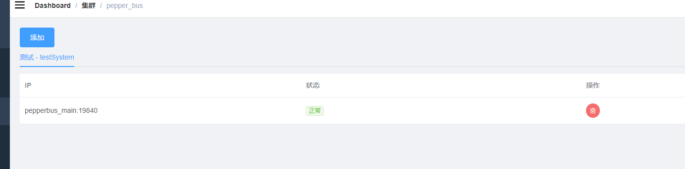
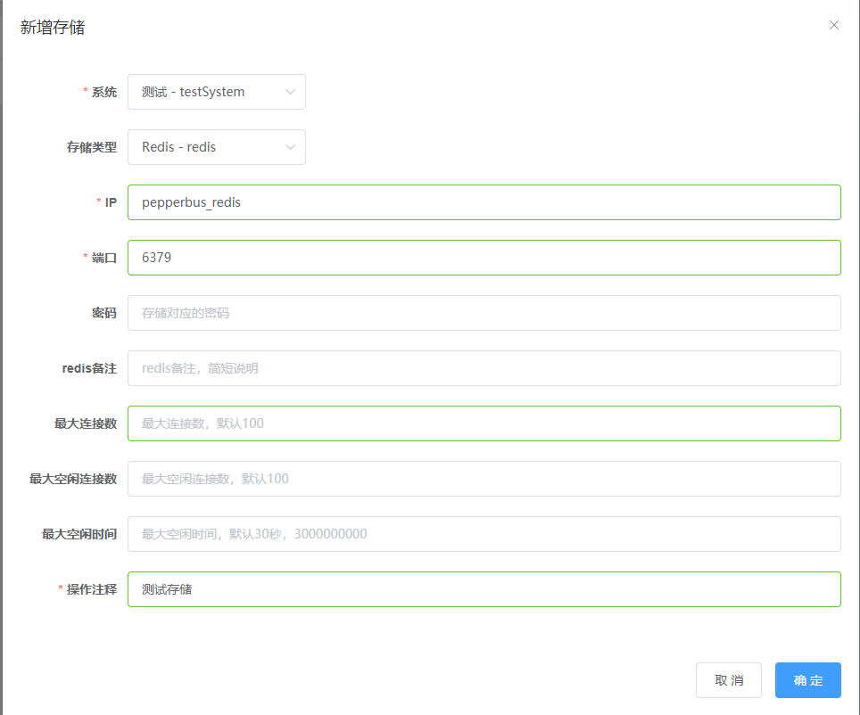
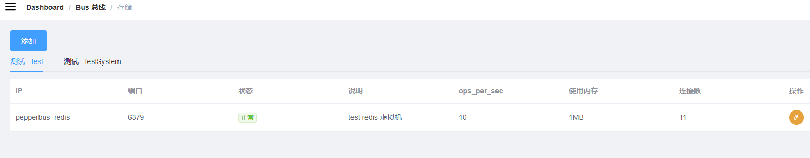
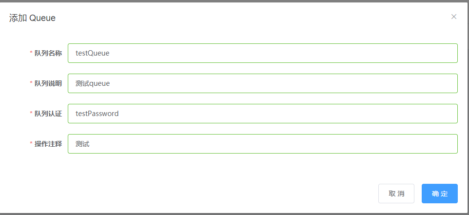
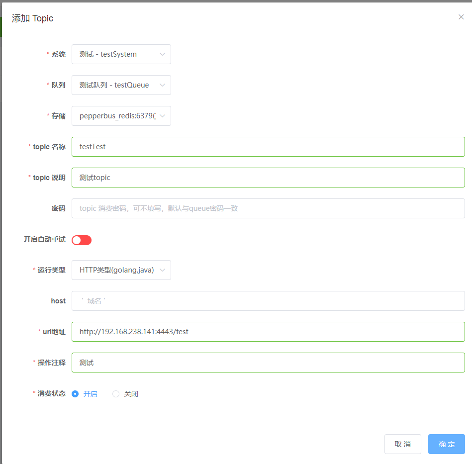
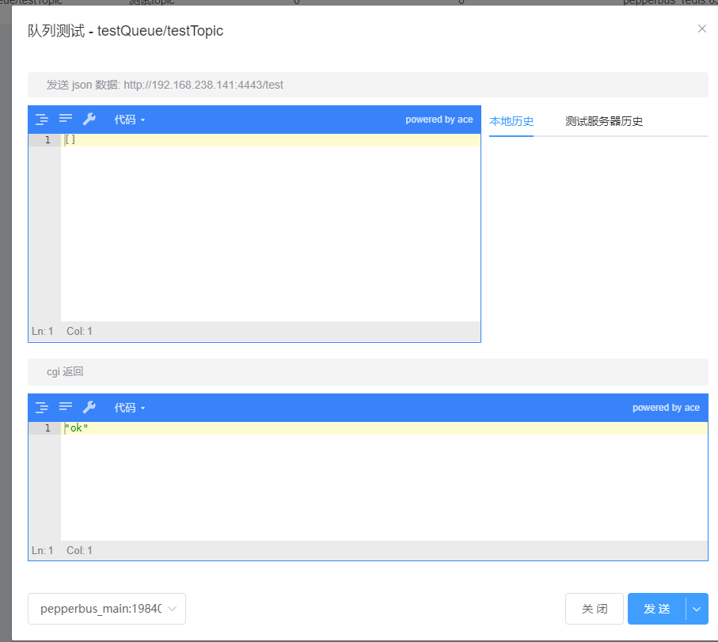
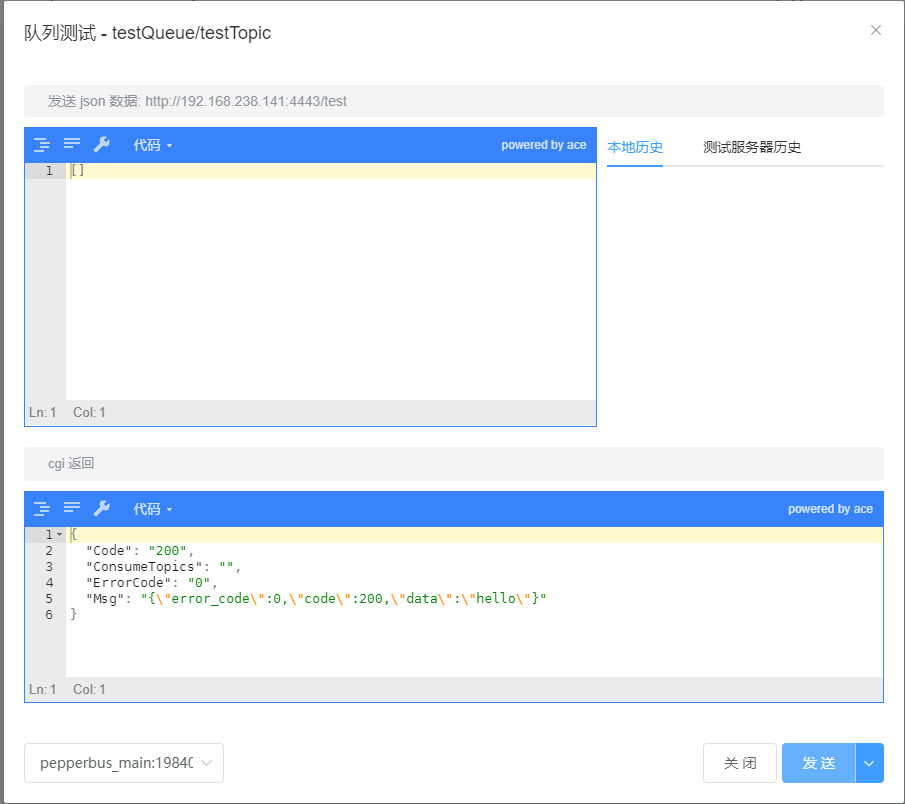
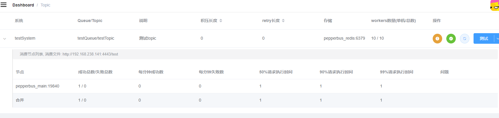

<p align="center">
    <a href="https://hub.docker.com/r/huajiao/dashboard" alt="Activity">
        </a>
    <a href="https://hub.docker.com/r/huajiao/gokeeper" alt="Activity">
        </a>
    
</p>


# dashboard - [pepperbus](https://github.com/huajiao-tv/pepperbus) & [peppercron](https://github.com/huajiao-tv/peppercron) 后台

## 添加系统

* 首先需要新建一个系统，系统只是根据用户需要而相互之间完全独立，用作标识，系统名称、系统说明可随便填写。 点击 系统-->添加系统：



## 添加集群

* 然后需要需要为该系统的集群添加节点，该节点即为运行pepperbus的服务器，可以直接使用pepperbus_main:19840连接默认节点（即为启动pepperbus服务的服务器）。 点击 集群-->pepper_bus-->添加：



* 状态呈“正常”即为添加成功：



## 添加存储

* 接下来需要添加存储节点，用于储存job信息，可以直接使用pepperbus_redis:6379。 点击 Bus总线-->存储-->添加：



* 状态呈“正常”即为添加成功：



* 至此pepprebus运行所需服务已配置完成，接下来为一个消费实例。

## 添加queue

* queue是用于接收job的队列，各属性可根据需要进行填写. 点击 Bus总线-->队列-->添加Queue：



## 添加topic

* topic用于标识queue的子队列，每个topic队列都对应地指定了一个消费文件（可以是php文件，也可以是http），当topic队列接收到job时，pepperbus便会有worker自动执行该消费文件 点击 Bus总线-->队列-->添加Topic：



* 示例中指定了一个http类型的消费文件，ip即为pepperbus服务器的ip

> 值得注意的是，由于pepperbus服务运行在docker容器中，此处不能使用127.0.0.1作为ip

## 运行http server

* 可使用SDk中封装好的函数运行server，go语言示例：

```go
busworker.NewWorkerRouter("/test/").RegisterJobHandler("testQueue","testTopic",testFunc)
busworker.Serve("192.168.238.141:4443")
```

* 处理函数定义：

```go
func testFunc(r *http.Request) *Resp{
	return &Resp{
		ErrorCode:0,
		Code:200,
		Data:"hello",
	}
}
```

## 测试

* 在topic页面点击最右侧的测试按钮可即打开测试窗口
	* 发送ping请求，在右下角"发送"按钮的下拉中选择ping，结果为ok表示可以连通
	
	

	* 测试消费请求，可以在输入框中输入想要测试的json数据，点击发送，即可查看返回结果，结果应与自定义的处理函数返回值保持一致
	
	
	

## 发送job

* 使用SDK中相应函数进行job的发送，即可使向队列中添加job，pepperbu会自动检测该服务并进行消费，go语言示例：

```go
re := busworker.NewClient("192.168.238.141:12018")
re.AddJobs("testQueue","test",[]string{"test data1","test data2"})
```

## 查看消费状态

* 点击 Bus总线-->队列-->topic（即为队列列表中“topic”列的按钮），即可查看topic队列的当前状态。可看到该job已成功消费

